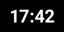

# OcuLED
Monitor PC status on a monochrome OLED LCD connected to a ESP8266. The program is controlled via any keyboard
(e.g. a [Pikatea Macropad](https://www.pikatea.com/products/pikatea-macropad-fk1)).

Some of the performance statistics require openhardwaremonitor to be running on the computer.

## Showcase

The above gif shows the following screens:

* Clock
* Media/now playing
* CPU/RAM/GPU usage
* CPU/GPU usage with temperatures